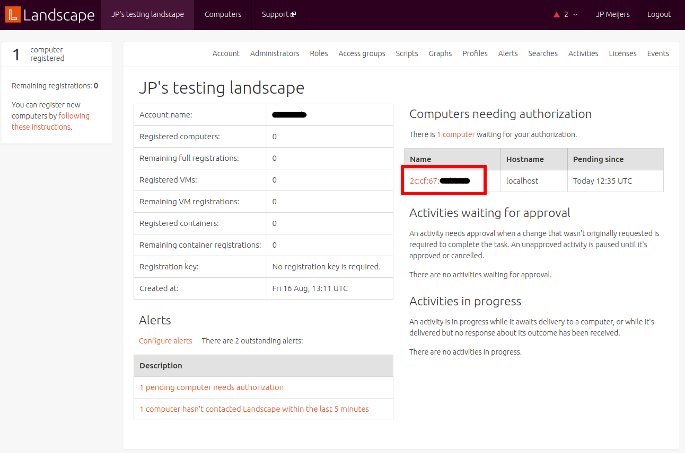
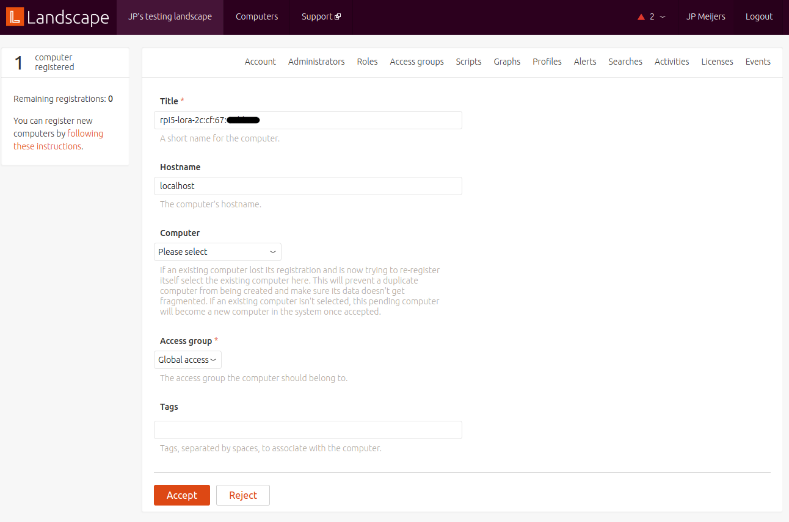
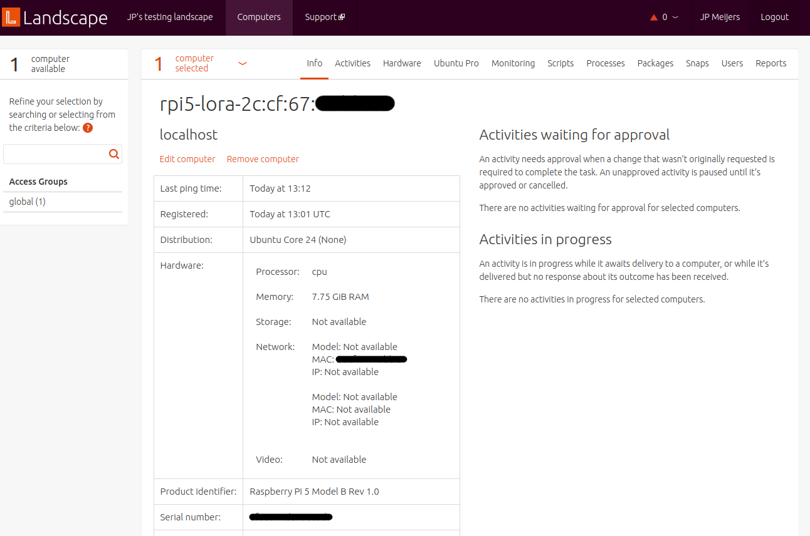
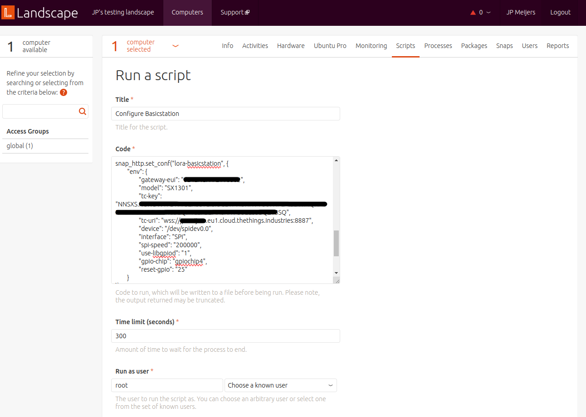
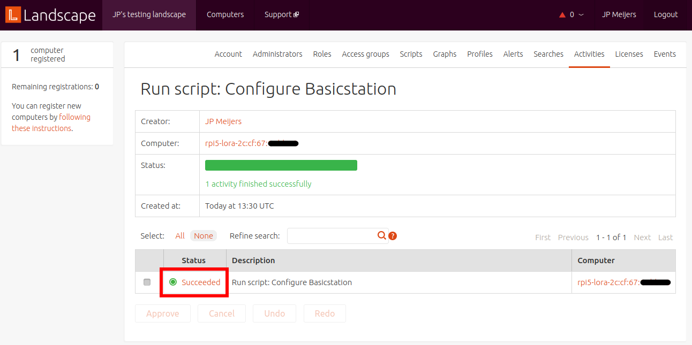
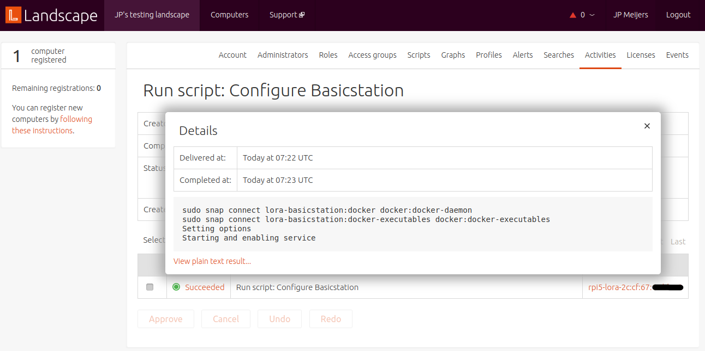
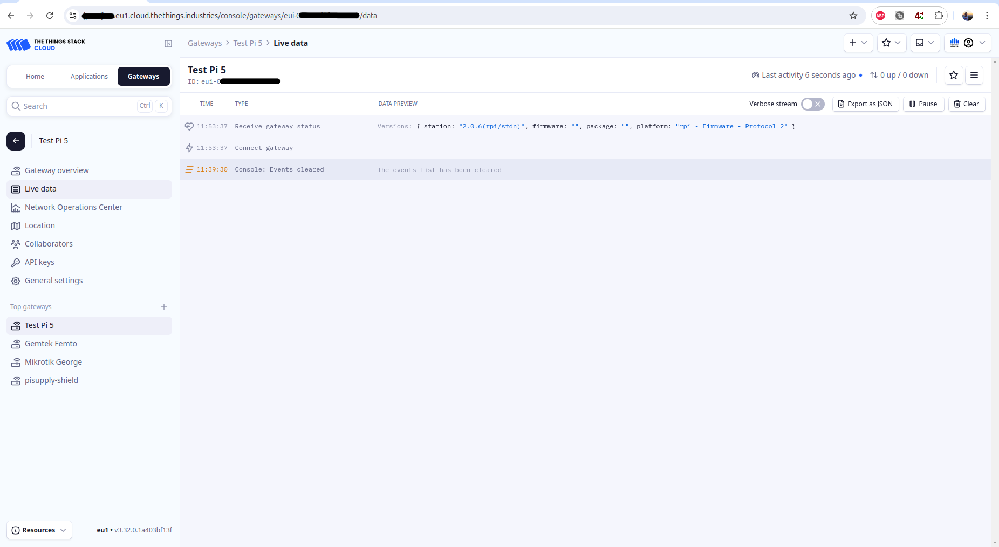

# Managing your gateway with Landscape

Landscape is a service by Canonical for the management of a fleet of devices running Ubuntu. Read more [here](https://ubuntu.com/landscape).

We assume you have already followed [this guide](ubuntu-core-image/README.md) to create a custom Ubuntu Core image with `lora-basicstation` and `landscape-client` preinstalled.

## Pending device

After your Raspberry Pi has started up, it should register with Landscape and appear on your Landscape dashboard as a pending device.

In our gadget snap we have configured `landscape-client` to use the device mac address as name.
Click on this name to configure and accept the device on to your Landscape instance.
You can customise the device title here.
Then click accept.

After accepting you will see the info page for the device.
Devices are called computers on Landscape.
To get back to this page in the future you can use the computers menu, then selecting the device your are interested in from the list.

Wait a couple of minutes for the device to check in. This info page will show some basic parameters of the device, like total memory, model and MAC addresses.

## Verify installed snaps

Under the Snaps tab, click on `Installed snaps`.
Here you can see which snaps are installed on the device, as well as update or remove them.
Verify that `lora-basicstation` is listed here.

To install more software on your device, you can click on `Install snaps` under the Snaps tab.

## Configure your gateway

Configuration of an Ubuntu Core device with Landscape is done using scripts.
We configure our gateway by setting snap options for `lora-basicstation` via a script.
An example script is provided [here](scripts/configure-lora-basicstation.sh).

On Landscape, after selecting your device from the list of computers, go to the scripts tab.
If presented with a choice, select `Run a new script` and then `Next`.
You will now see a form to create a new script.
Give it a name, something like `Configure Basicstation` will do.

In the code block paste the contents of the example script we linked to in the previous paragraph.
You can modify the configuration in the script to suite your needs.
The configuration follows the guide [here](../companion-snap-compose/README.md#configuration).

Enter `root` as user the script should run as.
Select to save the script.
Then click `Run`.

You will be redirected to the Activities tab where you will see the progress of the script.
After a couple of minutes you should see a success.

The text in the status column is clickable, and will show the output of the script. `stdout` on success and `stderr` on failure.

Log into your LoRa network server and check if your gateway is connected.

## Debugging

Debugging can be done by running scripts on the device.
Example scripts for Ubuntu Core devices on Landscape are available [here](https://github.com/canonical/landscape-scripts/tree/main/core).

Another debug option is to create a user account on the device, then log into the device over SSH, or locally using a keyboard and mouse.
The user management interface of Landscape does not currently work for Ubuntu Core.
Scripts to add users are available in the [examples](https://github.com/canonical/landscape-scripts/tree/main/core/users).

For example the `add-sso-user.py` script will add a user with an SSH key obtained from a Launchpad account.
